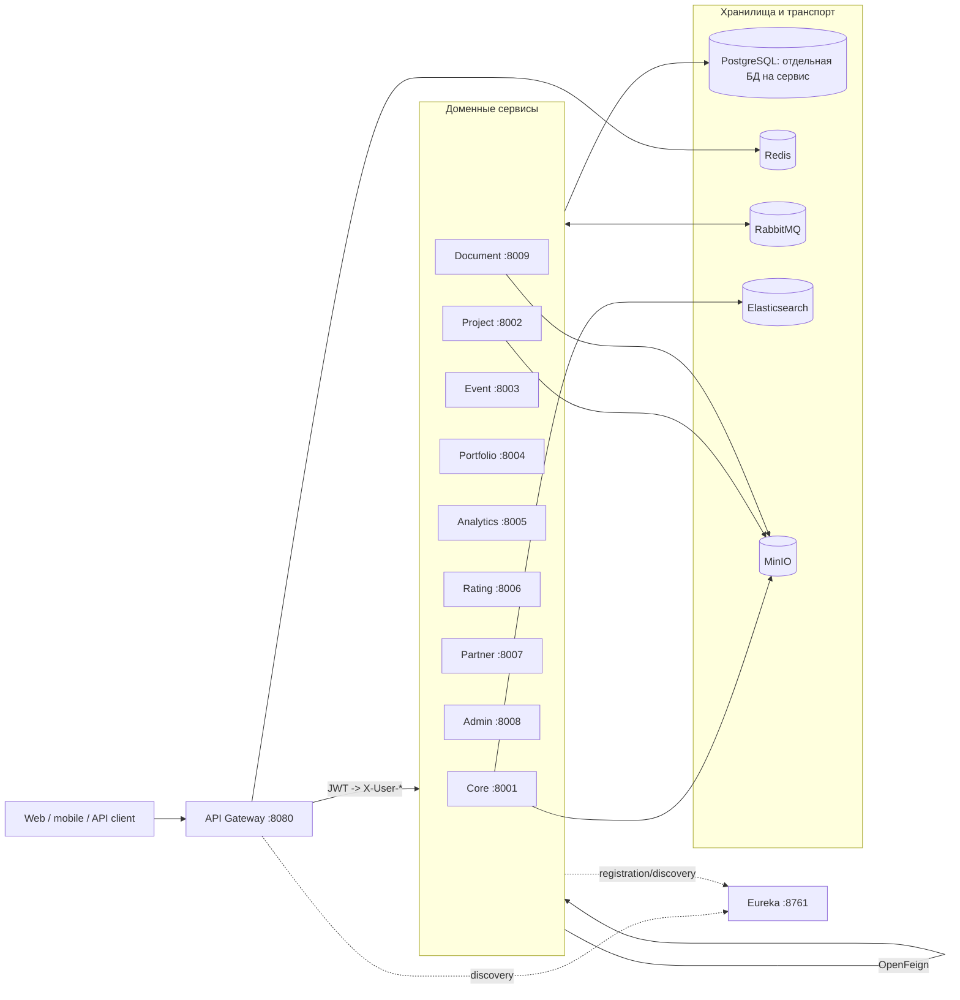

# ЕЦОПУ: устройство и руководство по репозиторию

> Единая цифровая образовательная платформа университета (ЕЦОПУ / ETSOPY).
>
> Документ описывает фактическое состояние исходного кода на 16 июля 2026 года (`b7610e6`): назначение модулей, архитектуру, данные, API, интеграции, безопасность, запуск, тестирование и известные ограничения. Исходный код и конфигурация имеют приоритет над этим обзором при последующих изменениях.

## Содержание

- [1. Назначение системы](#1-назначение-системы)
- [2. Архитектура верхнего уровня](#2-архитектура-верхнего-уровня)
- [3. Структура репозитория](#3-структура-репозитория)
- [4. Технологический стек](#4-технологический-стек)
- [5. Каталог модулей](#5-каталог-модулей)
- [6. Как обрабатывается запрос](#6-как-обрабатывается-запрос)
- [7. Доменные сервисы и реализованный функционал](#7-доменные-сервисы-и-реализованный-функционал)
- [8. Карта HTTP API](#8-карта-http-api)
- [9. Данные и миграции](#9-данные-и-миграции)
- [10. Межсервисное взаимодействие](#10-межсервисное-взаимодействие)
- [11. Аутентификация и авторизация](#11-аутентификация-и-авторизация)
- [12. Конфигурация и переменные окружения](#12-конфигурация-и-переменные-окружения)
- [13. Локальный запуск](#13-локальный-запуск)
- [14. Наблюдаемость](#14-наблюдаемость)
- [15. Сборка и тестирование](#15-сборка-и-тестирование)
- [16. CI/CD и контейнеризация](#16-cicd-и-контейнеризация)
- [17. Соглашения для разработки](#17-соглашения-для-разработки)
- [18. Текущие ограничения и технические риски](#18-текущие-ограничения-и-технические-риски)
- [19. Быстрый маршрут по коду](#19-быстрый-маршрут-по-коду)

## 1. Назначение системы

ЕЦОПУ — backend университетской платформы, объединяющей профиль студента или сотрудника, проектную и событийную деятельность, портфолио, рейтинги, аналитику, работу с партнёрами, документы и административные операции.

Основные пользовательские сценарии:

- регистрация, вход, обновление профиля и получение JWT;
- ведение сведений о факультетах, кафедрах, преподавателях и студентах;
- создание проектов, набор команды, постановка задач, комментарии и файлы;
- публикация мероприятий, подача заявок, формирование команд, расписание и защиты;
- автоматическое создание портфолио и накопление достижений;
- расчёт студенческих, преподавательских и кафедральных рейтингов;
- KPI и отчёты по проектам, мероприятиям и подразделениям;
- работа с партнёрами, кейсами, вакансиями и соглашениями;
- шаблоны, генерация и электронная фиксация подписания документов;
- административные роли, разрешения, аудит, настройки и учёт импорта/экспорта;
- поиск по пользователям, проектам, мероприятиям и документам;
- уведомления и чат, включая STOMP/WebSocket.

Репозиторий — Maven-монорепозиторий с микросервисной архитектурой. Девять доменных сервисов имеют отдельные PostgreSQL-базы и Flyway-миграции. Общение сочетает синхронные REST-вызовы через OpenFeign и асинхронные доменные события через RabbitMQ.

### Уровни готовности в этом документе

- **Реализовано** — есть рабочая бизнес-логика, хранение данных и HTTP/API-контур.
- **Частично** — основной контракт существует, но часть обработки является упрощённой.
- **Заглушка** — интерфейс и демонстрационное поведение есть, внешняя система не подключена.
- **Подготовлено инфраструктурно** — контейнер или конфигурация присутствуют, но приложение ещё не использует возможность полностью.

## 2. Архитектура верхнего уровня



### Ключевые архитектурные решения

1. **Единая входная точка.** Внешние HTTP-запросы должны идти через `api-gateway` на порту `8080`.
2. **Service discovery.** Gateway и сервисы используют Eureka и адреса вида `lb://core-service`.
3. **Database per service.** У каждого доменного сервиса своя база `etsopy_<domain>`; внешние ключи между базами отсутствуют, связи представлены UUID.
4. **Событийная согласованность.** Побочные действия — обновление рейтинга, портфолио, поискового индекса, аналитики и уведомлений — инициируются RabbitMQ-событиями.
5. **Общий security context.** Gateway проверяет JWT, добавляет `X-User-Id` и `X-User-Role`; сервисы превращают эти заголовки в Spring Security `Authentication`.
6. **Общие контракты.** `shared-lib` содержит DTO, enum, события, ответы, security-фильтры, RabbitMQ-конфигурацию и абстракцию файлового хранилища.
7. **Разделение инфраструктуры и домена.** PostgreSQL, Redis, RabbitMQ, Elasticsearch, MinIO, Prometheus, Grafana и Zipkin поднимаются через Docker Compose.

## 3. Структура репозитория

```text
.
├── api-gateway/             # WebFlux gateway, JWT-фильтр, маршруты, rate limit, fallback
├── eureka-server/           # реестр сервисов Netflix Eureka
├── core-service/            # пользователи, auth, оргструктура, заявки, чат, поиск, уведомления
├── project-service/         # проекты, участники, задачи, файлы, шаблоны, комментарии
├── event-service/           # мероприятия, заявки, команды, задания, занятия и защиты
├── portfolio-service/       # портфолио, навыки, достижения, отзывы, академические сведения
├── analytics-service/       # KPI и отчёты
├── rating-service/          # рейтинги и достижения рейтинговой системы
├── partner-service/         # партнёры, кейсы, вакансии и соглашения
├── admin-service/           # роли, разрешения, аудит, настройки, импорт/экспорт
├── document-service/        # шаблоны, плейсхолдеры, генерация и подписи документов
├── shared-lib/              # общий прикладной код и контракты
├── security-lib/            # JWT/security-код, используемый gateway
├── test-support/            # Testcontainers и общие средства интеграционных тестов
├── infrastructure/          # Prometheus, Grafana, PostgreSQL init, Nginx и служебный Dockerfile
├── init-db/                 # создание девяти PostgreSQL-баз
├── test/                    # compose-файл проверки сборки Docker-образов
├── Documentation/           # ТЗ, исходная таблица требований и этот обзор
├── src/                     # остаточный standalone DemoApplication; не собирается root POM
├── pom.xml                  # текущий агрегатор Maven (15 модулей)
├── pom-parent.xml           # общий parent большинства сервисов
├── pom-root.xml             # альтернативный/исторический агрегатор
├── docker-compose.yml       # локальный полный стек
├── docker-compose.prod.yml  # production-подобный полный стек
├── .env.example             # шаблон переменных окружения
└── .gitlab-ci.yml           # GitLab pipeline
```

### Типовая внутренняя структура сервиса

Большинство доменных модулей следуют слоистой схеме:

```text
src/main/java/com/example/<service>/
├── config/          # Security, OpenAPI и специальные bean-конфигурации
├── controller/      # REST-контроллеры
├── service/         # бизнес-логика и границы транзакций
├── repository/      # Spring Data JPA/Elasticsearch
├── model/           # JPA-сущности и enum
├── dto/             # входные и выходные модели API
├── client/          # OpenFeign-клиенты
├── listener/        # RabbitMQ consumers
├── mapper/          # MapStruct или ручные преобразования
├── integration/     # адаптеры внешних систем и заглушки
└── exception/       # обработчики ошибок

src/main/resources/
├── application.yml
└── db/migration/    # V001..., V002... — Flyway
```

## 4. Технологический стек

| Область | Технологии |
|---|---|
| Язык и сборка | Java 17, Maven Wrapper, Maven multi-module |
| Приложение | Spring Boot 3.2.0, Spring Framework 6 |
| Облако | Spring Cloud 2023.0.0, Eureka, Gateway, OpenFeign |
| HTTP | Spring MVC в сервисах, Spring WebFlux в gateway |
| Данные | PostgreSQL 14, Spring Data JPA, Hibernate, Flyway |
| Кэш | Redis; локально в старом root-конфиге также упомянут Caffeine |
| События | RabbitMQ 3.12, Spring AMQP, topic exchanges |
| Поиск | Elasticsearch 8.11.3, Spring Data Elasticsearch |
| Файлы | MinIO, общий `FileStorageService` |
| Безопасность | Spring Security, JWT HS256 (`jjwt`), method security |
| Отказоустойчивость | Resilience4j circuit breaker, gateway fallback |
| API-документация | springdoc-openapi / Swagger UI |
| Наблюдаемость | Actuator, Micrometer Prometheus, Prometheus, Grafana; Zipkin подготовлен контейнером |
| Маппинг/boilerplate | MapStruct, Lombok |
| Тесты | JUnit 5, Mockito, AssertJ, Testcontainers, WireMock, Awaitility |
| Доставка | Docker multi-stage builds, Docker Compose, GitLab CI, заготовки Kubernetes deploy |

## 5. Каталог модулей

### Запускаемые компоненты

| Модуль | Порт | База | Основная ответственность |
|---|---:|---|---|
| `api-gateway` | 8080 | — | маршрутизация, JWT, CORS, rate limit, circuit breaker, Swagger aggregation |
| `eureka-server` | 8761 | — | реестр и discovery сервисов |
| `core-service` | 8001 | `etsopy_core` | пользователи, auth, оргструктура, заявки, чат, уведомления, поиск |
| `project-service` | 8002 | `etsopy_project` | проекты, команды, задачи, проектные файлы и шаблоны |
| `event-service` | 8003 | `etsopy_event` | мероприятия, заявки, команды, задания, занятия, защиты |
| `portfolio-service` | 8004 | `etsopy_portfolio` | портфолио, достижения, навыки, отзывы, academic info |
| `analytics-service` | 8005 | `etsopy_analytics` | KPI, значения KPI и отчёты |
| `rating-service` | 8006 | `etsopy_rating` | рейтинги студентов, преподавателей, кафедр и история начислений |
| `partner-service` | 8007 | `etsopy_partner` | партнёры, контакты, кейсы, вакансии, соглашения |
| `admin-service` | 8008 | `etsopy_admin` | роли, разрешения, аудит, настройки, операции с данными |
| `document-service` | 8009 | `etsopy_document` | шаблоны, плейсхолдеры, сгенерированные документы и подписи |

### Библиотеки и служебные модули

| Модуль | Назначение |
|---|---|
| `shared-lib` | общие DTO, enum, ответы, исключения, события, RabbitMQ bindings, header-based security, Feign interceptor и MinIO storage |
| `security-lib` | отдельная реализация JWT и gateway authentication filter; фактически нужна `api-gateway` |
| `test-support` | singleton Testcontainers для PostgreSQL, RabbitMQ, Redis, Elasticsearch, MinIO и базовый класс интеграционных тестов |
| `infrastructure` | конфигурации Prometheus/Grafana/Nginx/PostgreSQL; Java-кода нет |

## 6. Как обрабатывается запрос

Обычный защищённый REST-запрос проходит следующую цепочку:

1. Клиент вызывает `http://localhost:8080/api/v1/...` и передаёт `Authorization: Bearer <access-token>`.
2. `AuthorizationHeaderFilter` gateway пропускает только явно публичные пути без токена (`login`, `register`, Actuator и OpenAPI).
3. Gateway валидирует подпись и срок JWT общим `JWT_SECRET`, извлекает `sub` и `role`.
4. Исходный `Authorization` удаляется; downstream-запрос получает доверенные заголовки `X-User-Id` и `X-User-Role`.
5. Gateway выбирает сервис по `Path`, находит экземпляр через Eureka и применяет circuit breaker. Для core/project/event дополнительно действует Redis rate limiter по IP: 50 запросов/с, burst 100.
6. В MVC-сервисе `RoleHeaderFilter` создаёт `UsernamePasswordAuthenticationToken` с authority `ROLE_<role>`.
7. `@AuthenticatedOnly`, `@LecturerOrAbove`, `@AdminOnly` или `@PreAuthorize` проверяют доступ.
8. Контроллер вызывает service layer; изменения JPA выполняются в транзакции сервиса.
9. При необходимости сервис обращается в другой сервис через Feign. `FeignClientInterceptor` переносит текущие `X-User-*` заголовки.
10. Доменные изменения могут публиковать событие RabbitMQ; consumers асинхронно обновляют другие bounded contexts.

Если downstream недоступен или circuit breaker открыт, gateway возвращает `503 SERVICE_UNAVAILABLE` через `/fallback`.

## 7. Доменные сервисы и реализованный функционал

### 7.1. `core-service`

Центральный сервис идентичности и общеплатформенных функций. Это самый крупный модуль.

**Реализовано:**

- регистрация с ролью `STUDENT`, BCrypt-хеширование пароля, вход, access/refresh JWT;
- получение и изменение профиля, расширенные поля студента, преподавателя и заведующего;
- восстановление пароля по JWT reset token;
- факультеты и кафедры, списки студентов/преподавателей и выборки по группе/кафедре/факультету;
- навыки, языки, ссылки, награды, пользовательские документы и экстренные контакты;
- универсальные заявки преподавателю/администратору, статусы, приоритеты и комментарии;
- пользовательские dashboards с агрегацией данных project/event/rating сервисов;
- чаты, сообщения и автоматическое создание проектных чатов по событиям RabbitMQ;
- уведомления, настройки уведомлений и unread-счётчики;
- календарный export в iCalendar и URL подписки;
- Elasticsearch-поиск по проектам, мероприятиям, пользователям и документам;
- STOMP endpoint `/ws`, application prefix `/app`, broker topics `/topic` и `/queue`;
- публикация `user.created`, обработка событий проектов, поиска и уведомлений.

**Основные таблицы:** `users`, `faculties`, `departments`, `user_skills`, `user_languages`, `user_links`, `user_awards`, `user_documents`, `emergency_contacts`, `sessions`, `applications`, `application_comments`, `dashboards`, `chats`, `messages`, `notifications`, `notification_settings`, `lecturer_academic_metrics`.

**Внешние зависимости:** project/event/rating через Feign, Elasticsearch для индекса `etsopy_search`, MinIO для пользовательских файлов, Redis cache, RabbitMQ.

**Заглушки:** реальный SSO, SMTP/email и Telegram bot заменены `StubSsoAuthenticationProvider`, `StubEmailService` и `StubTelegramBotService`. Заглушка email пишет reset token в лог — это допустимо только для разработки.

### 7.2. `project-service`

Отвечает за полный жизненный цикл учебных и прикладных проектов.

**Реализовано:**

- создание, получение, изменение, смена статуса и удаление проектов;
- выборки по пользователю и кафедре, пользовательская/кафедральная статистика, batch-статистика преподавателей;
- участники проекта с ролями, вступление/выход и проверка leader/member через `ProjectSecurity`;
- задачи, назначение исполнителя, статусы, recent tasks и статистика;
- комментарии проекта;
- загрузка и скачивание проектных документов через MinIO;
- проектные шаблоны;
- кэш имён пользователей, получаемых из `core-service`;
- события `project.created`, `project.status_changed`, `project.member_added/removed`, `project.task_completed`, `project.document_uploaded`;
- notification commands при назначении задачи.

**Основные таблицы:** `projects`, `project_members`, `tasks`, `project_documents`, `project_templates`, `project_comments`.

**Статусы:** проекты — `ACTIVE`, `COMPLETED`, `FROZEN`, `CANCELLED`; задачи — `TO_DO`, `IN_PROGRESS`, `REVIEW`, `DONE`, `BLOCKED`.

**Заглушка:** бронирование ресурсов мегалабораторий возвращает демонстрационные слоты и случайный booking ID.

### 7.3. `event-service`

Управляет мероприятиями и связанными учебными активностями.

**Реализовано:**

- CRUD мероприятий и представления, адаптированные для студента и преподавателя;
- заявки на мероприятия, личные заявки и решение команды по заявке;
- команды и участники команд;
- менторы и event tasks;
- расписание занятий (`LECTURE`, `SEMINAR`, `PRACTICE`, `OTHER`);
- защиты ВКР/курсовых/исследовательских работ и смена их статуса;
- получение профилей пользователей из `core-service` и cache имён;
- публикация событий создания/изменения мероприятия, решения по заявке, формирования команды и завершения;
- notification commands участникам.

**Основные таблицы:** `events`, `event_applications`, `teams`, `team_members`, `event_mentors`, `event_tasks`, `lessons`, `defenses`.

**Статусы мероприятия:** `DRAFT`, `PUBLISHED`, `REGISTRATION_OPEN`, `IN_PROGRESS`, `COMPLETED`, `CANCELLED`.

### 7.4. `portfolio-service`

Хранит представление достижений пользователя независимо от core-профиля.

**Реализовано:**

- получение портфолио и настройка видимости;
- достижения, навыки с уровнем и верификацией преподавателем, отзывы;
- поиск пользователей по навыку;
- академические сведения;
- автоматическое создание портфолио после `user.created`;
- пополнение портфолио после завершённого мероприятия;
- реакция на перерасчёт рейтинга;
- публикация `portfolio.achievement_added` для rating/search контуров.

**Основные таблицы:** `portfolios`, `achievements`, `skills`, `reviews`, `academic_info`.

### 7.5. `analytics-service`

Предназначен для KPI и генерации отчётов.

**Реализовано:**

- каталог KPI, пользовательские KPI, значения KPI для проекта/кафедры и платформенные KPI;
- создание и хранение отчётов, списки всех/собственных отчётов и получение по ID;
- Feign-доступ к core/project/event;
- consumers изменений статусов проектов, завершения задач и мероприятий.

**Основные таблицы:** `kpi`, `kpi_values`, `reports`, `academic_performance`.

**Частично:** вычисление KPI сейчас сохраняет `0`, event listeners только логируют события, а export отчёта возвращает предполагаемый путь `/reports/generated/...` без создания файла. LMS представлен `StubLmsDataProvider` с фиксированными оценками.

### 7.6. `rating-service`

Собирает события активности и формирует рейтинговые представления.

**Реализовано:**

- рейтинг студента, top, детализация истории, breakdown, сравнение и позиция leaderboard;
- рейтинговые достижения пользователя;
- рейтинг преподавателя;
- рейтинг и ranking кафедр;
- CRUD критериев рейтинга с admin-only изменениями;
- история начислений и настройки рейтинга;
- перерасчёт по событиям пользователя, проекта, задачи, мероприятия, решения по заявке и достижения портфолио;
- публикация `rating.recalculated`.

**Основные таблицы:** `rating_criteria`, `student_ratings`, `lecturer_ratings`, `department_ratings`, `rating_history`, `rating_settings`, `earned_achievements`.

**Синхронные зависимости:** core для профилей и списков студентов; project для состава проекта.

### 7.7. `partner-service`

Контур взаимодействия университета с внешними организациями.

**Реализовано:**

- регистрация партнёра, просмотр/изменение и смена статуса партнёрства;
- контакты партнёра на service/repository уровне;
- кейсы, активные кейсы и выборка по партнёру;
- вакансии, активные вакансии и выборка по партнёру;
- соглашения и смена их статуса;
- публикация новых кейсов и вакансий в RabbitMQ для поискового контура.

**Основные таблицы:** `partners`, `partner_contacts`, `cases`, `vacancies`, `agreements`.

### 7.8. `admin-service`

Административный bounded context, весь HTTP API защищён `@AdminOnly`.

**Реализовано:**

- назначение системной роли пользователю в локальной таблице `user_roles`;
- матрица `role_permissions`;
- аудит с фильтрацией;
- системные настройки;
- создание записей операций импорта/экспорта и просмотр их истории;
- публикация `user.role_changed`.

**Основные таблицы:** `user_roles`, `role_permissions`, `audit_logs`, `system_settings`, `data_operations`.

**Частично:** импорт/экспорт создаёт запись со статусом `PENDING`, но фактической обработки файла и перехода статуса нет. Роль хранится отдельно от `core-service.users.role`; синхронизация описана в разделе ограничений.

### 7.9. `document-service`

Контур управляемых шаблонов и электронного подписания.

**Реализовано:**

- CRUD шаблонов документов и их placeholders;
- метаданные сгенерированного документа;
- фиксация электронной подписи: подписант, время, тип, IP, user-agent и комментарий;
- публикация `document.generated`;
- download-контракт через MinIO.

**Основные таблицы:** `document_templates`, `placeholders`, `generated_documents`, `document_signatures`.

**Частично:** `generateDocument` формирует только путь и запись со статусом `COMPLETED`; PDF не рендерится и не загружается в MinIO. Поэтому download вновь созданного документа не найдёт объект без дополнительного генератора.

### 7.10. `api-gateway` и `eureka-server`

Gateway работает реактивно и не имеет БД. Он содержит:

- статические path routes ко всем сервисам;
- load balancing через Eureka;
- глобальный JWT/header filter;
- CORS и удаление cookies;
- Redis rate limiting для core/project/event;
- Resilience4j circuit breakers и единый `503` fallback;
- прокси `/service-docs/{service}` для OpenAPI и агрегированный Swagger UI.

Eureka работает в standalone-режиме на `8761`, не регистрирует сам себя и предоставляет dashboard реестра.

### 7.11. Общие библиотеки

`shared-lib` подключён почти ко всем MVC-сервисам и предоставляет:

- `BaseEntity`/`AuditableEntity`;
- общие `UserRole`, `ProjectStatus`, `TaskStatus`, `EventStatus`, DTO dashboard и межсервисных ответов;
- унифицированные `ApiResponse<T>` и `PageResponse<T>`;
- прикладные исключения;
- `JwtTokenProvider`, `RoleHeaderFilter`, security annotations и `FeignClientInterceptor`;
- `EventPublisher`, event payloads, exchanges, queues и bindings RabbitMQ;
- `FileStorageService` и MinIO implementation;
- JSON, logging и validation utilities.

`security-lib` дублирует часть JWT/security-кода и используется gateway. При изменении формата JWT нужно проверять обе реализации.

## 8. Карта HTTP API

Все пути ниже предполагают gateway base URL `http://localhost:8080`. Полные входные/выходные схемы доступны в Swagger UI.

### 8.1. Core API

| Base path | Возможности |
|---|---|
| `/api/v1/auth` | register, login, refresh, forgot/reset password, профиль и его обновление, teacher/head details |
| `/api/v1/auth/sso` | SSO callback через заглушку provider |
| `/api/v1/users/students` | список, поиск, группы, IDs по группе/кафедре/факультету |
| `/api/v1/users/teachers` | обычный и агрегированный подробный список |
| `/api/v1/faculties` | CRUD факультетов; изменения только admin |
| `/api/v1/departments` | CRUD кафедр и выборка по факультету; изменения только admin |
| `/api/v1/applications` | заявки по преподавателю/студенту, pending admin, статус, comments, withdraw |
| `/api/v1/dashboards` | summary пользователя и CRUD dashboard-конфигурации |
| `/api/v1/chats` | CRUD чатов |
| `/api/v1/messages` | CRUD сообщений; в текущей gateway route отсутствует этот path |
| `/api/v1/notifications` | уведомления пользователя, unread, count и mark-read |
| `/api/v1/notification-settings` | CRUD настроек уведомлений |
| `/api/v1/search` | полнотекстовый поиск с type/page/size |
| `/api/v1/calendar` | `.ics` export и URL подписки |
| `/api/v1/user-skills` | CRUD навыков пользователя |
| `/api/v1/user-languages` | CRUD языков |
| `/api/v1/user-links` | CRUD внешних ссылок |
| `/api/v1/user-awards` | награды пользователя |
| `/api/v1/user-documents` | upload/list/download/delete документов профиля |
| `/api/v1/emergency-contacts` | CRUD экстренных контактов |
| `/api/v1/sessions` | CRUD сессий, список только admin |
| `/api/v1/integrations/telegram` | связывание Telegram-аккаунта через заглушку |
| `/ws` | SockJS/STOMP endpoint; сообщения `/app/chat/{chatId}`, подписка `/topic/chat/{chatId}` |

### 8.2. Project API

| Base path | Возможности |
|---|---|
| `/api/v1/projects` | CRUD, status, user/department выборки, stats, dashboard, batch teacher stats |
| `/api/v1/projects/{projectId}/members` | add/list/remove/leave |
| `/api/v1/projects/{projectId}/comments` | list/add комментариев |
| `/api/v1/tasks` | CRUD, patch, status, assignee, выборки и статистика |
| `/api/v1/documents` | проектные upload/download/get/list/delete |
| `/api/v1/project-templates` | create/get/list шаблонов проекта |

### 8.3. Event API

| Base path | Возможности |
|---|---|
| `/api/v1/events` | CRUD, applications и teams мероприятия |
| `/api/v1/events/view` | агрегированные student/teacher views |
| `/api/v1/event-applications` | CRUD, my, by-team, team-decision |
| `/api/v1/teams` | CRUD команд |
| `/api/v1/team-members` | CRUD участников с составным ID |
| `/api/v1/event-tasks` | CRUD заданий мероприятия |
| `/api/v1/event-mentors` | CRUD менторов с составным ID |
| `/api/v1/events/schedule/lessons` | расписание занятий |
| `/api/v1/events/defenses` | список/создание/смена статуса защиты |

### 8.4. Остальные сервисы

| Сервис | Base paths | Возможности |
|---|---|---|
| Portfolio | `/api/v1/portfolios` | портфолио, visibility, achievements, skills, reviews, search by skill |
| Analytics | `/api/v1/kpi`, `/api/v1/reports` | KPI и отчёты |
| Rating | `/api/v1/ratings/students`, `/api/v1/ratings/lecturers`, `/api/v1/ratings/departments`, `/api/v1/ratings/criteria` | рейтинги, leaderboard, breakdown, criteria |
| Partner | `/api/v1/partners`, `/api/v1/cases`, `/api/v1/vacancies`, `/api/v1/agreements` | партнёры и их предложения |
| Admin | `/api/v1/admin/users`, `/api/v1/admin/roles`, `/api/v1/admin/audit`, `/api/v1/admin/settings`, `/api/v1/admin/data` | управление платформой |
| Document | `/api/v1/document-templates`, `/api/v1/documents` | шаблоны, генерация, download и sign |

Обратите внимание: project и document сервисы используют одинаковый base path `/api/v1/documents`. Текущая первая gateway route отправляет его в `project-service`; document generation доступна напрямую на `8009`, но не маршрутизируется однозначно через gateway.

## 9. Данные и миграции

### 9.1. Владение данными

| База | Владелец | Таблицы верхнего уровня | Последняя миграция |
|---|---|---|---:|
| `etsopy_core` | core | users, org structure, applications, chats, notifications, profile details | V018 |
| `etsopy_project` | project | projects, members, tasks, documents, templates, comments | V007 |
| `etsopy_event` | event | events, applications, teams, mentors, tasks, lessons, defenses | V010 |
| `etsopy_portfolio` | portfolio | portfolios, achievements, skills, reviews, academic_info | V003 |
| `etsopy_analytics` | analytics | reports, kpi, kpi_values, academic_performance | V004 |
| `etsopy_rating` | rating | criteria, student/lecturer/department ratings, history, settings, achievements | V008 |
| `etsopy_partner` | partner | partners, contacts, cases, vacancies, agreements | V003 |
| `etsopy_admin` | admin | user_roles, permissions, audit, settings, data_operations | V002 |
| `etsopy_document` | document | templates, placeholders, generated documents, signatures | V003 |

Базы создаёт `init-db/create-dbs.sql`, смонтированный в стандартный init-каталог PostgreSQL. Затем каждый сервис применяет только собственные миграции из `classpath:db/migration`.

### 9.2. Правила работы со схемой

- `spring.jpa.hibernate.ddl-auto=validate`: Hibernate не создаёт схему и требует соответствия JPA-модели миграциям.
- Новые изменения добавляются новой миграцией `VNNN__meaningful_name.sql`; существующие применённые файлы не переписываются.
- Seed-данные являются частью миграций и используются для демонстрационного окружения.
- Межсервисные UUID не защищены внешними ключами на уровне PostgreSQL. Валидность обеспечивается сервисной логикой и событиями.
- Распределённых транзакций нет. Каждая БД фиксируется независимо.

## 10. Межсервисное взаимодействие

### 10.1. Синхронные REST-вызовы

| Инициатор | Получатель | Для чего |
|---|---|---|
| core | project | проекты пользователя, задачи, статистика, dashboard кафедры, teacher stats |
| core | event | список мероприятий и защит |
| core | rating | рейтинги студента и преподавателя |
| project | core | профиль/имя участника |
| event | core | профиль/имя пользователя |
| analytics | core | профиль пользователя |
| analytics | project | проекты для отчётов |
| analytics | event | мероприятия для отчётов |
| rating | core | профиль и выборки студентов |
| rating | project | состав проекта |

Feign-клиенты используют Eureka service names. `FeignClientInterceptor` переносит user ID и роль, поэтому method security в downstream продолжает работать.

### 10.2. Асинхронные события RabbitMQ

Topic exchanges:

- `etsopy.user`
- `etsopy.project`
- `etsopy.event`
- `etsopy.rating`
- `etsopy.notification`
- `etsopy.search`
- `etsopy.portfolio`
- `etsopy.partner`
- `etsopy.document`

Основные рабочие цепочки:

| Событие | Издатель | Потребители/эффект |
|---|---|---|
| `user.created` | core | создать portfolio, создать initial rating, добавить пользователя в поиск |
| `project.created` | project | создать чат проекта, добавить проект в поиск |
| `project.member_added/removed` | project | обновить участников проектного чата |
| `project.status_changed` | project | rating recalculation и analytics listener |
| `project.task_completed` | project | rating recalculation и analytics listener |
| `project.document_uploaded` | project | добавить документ в поиск |
| `event.created` | event | добавить мероприятие в поиск |
| `event.application_decided` | event | rating listener и уведомления, если подключены к queue |
| `event.team_formed` | event | уведомления |
| `event.completed` | event | rating, portfolio и analytics |
| `portfolio.achievement_added` | portfolio | rating и подготовленный search queue |
| `rating.recalculated` | rating | portfolio и подготовленный core queue |
| `notification.send` | разные сервисы | core сохраняет уведомление и отправляет WebSocket update |
| `partner.case_published` / `partner.vacancy_published` | partner | подготовленные search queues |
| `document.generated` | document | подготовленная notification queue |
| `user.role_changed` | admin | событие публикуется; фактический core consumer отсутствует |

Очереди и bindings централизованы в `RabbitMqAutoConfiguration`. Consumers в основном принимают `Map<String,Object>`, поэтому изменение имён полей события нужно синхронизировать между издателем и потребителем.

### 10.3. Redis, Elasticsearch и MinIO

- **Redis** хранит cache сервисов и состояние gateway rate limiter. Имена пользователей и агрегированные представления кэшируются через `@Cacheable`.
- **Elasticsearch** используется core-сервисом. Rabbit listeners создают документы индекса `etsopy_search`; поиск идёт по `title` и `description` с необязательным `entityType`.
- **MinIO** подключается через `FileStorageAutoConfiguration`, если задан `minio.endpoint`. Core хранит пользовательские документы, project — проектные, document должен хранить сгенерированные PDF.

## 11. Аутентификация и авторизация

### 11.1. JWT

Access token подписывается HS256 и содержит:

- `sub` — UUID пользователя;
- `email`;
- `role`;
- `type=access`;
- `iat`, `exp`.

Refresh token содержит `sub`, `type=refresh`, `iat`, `exp`. По умолчанию access token живёт 24 часа, refresh token — 7 дней.

Поддерживаемые роли из `shared-lib`:

- `STUDENT`
- `LECTURER`
- `DEPARTMENT_HEAD`
- `PARTNER`
- `ADMIN`

### 11.2. Method security

- `@AuthenticatedOnly` — любой аутентифицированный пользователь.
- `@LecturerOrAbove` — преподаватель, заведующий или администратор согласно meta-annotation.
- `@AdminOnly` — только `ROLE_ADMIN`.
- `@PreAuthorize("@projectSecurity...")` — membership/leadership конкретного проекта.

### 11.3. Граница доверия

Внутренние сервисы не перепроверяют JWT: они доверяют `X-User-Id` и `X-User-Role`. Поэтому production-сеть должна запрещать прямой внешний доступ к портам `8001–8009`; доступ должен идти только через gateway или доверенный reverse proxy. Локальный compose публикует эти порты на host для отладки, что не является безопасной production-топологией.

## 12. Конфигурация и переменные окружения

Скопируйте `.env.example` в `.env`. Файл `.env` исключён из Git и не должен содержать демонстрационные секреты в production.

| Переменные | Назначение |
|---|---|
| `DB_HOST`, `DB_PORT`, `DB_USERNAME`, `DB_PASSWORD` | PostgreSQL и учётные данные всех сервисных БД |
| `REDIS_HOST`, `REDIS_PORT` | Redis cache/rate limiting |
| `RABBITMQ_HOST`, `RABBITMQ_PORT`, `RABBITMQ_USERNAME`, `RABBITMQ_PASSWORD` | event broker |
| `ELASTICSEARCH_HOST`, `ELASTICSEARCH_PORT` | host mapping инфраструктуры |
| `ELASTICSEARCH_URL` | URL, реально читаемый core (`http://elasticsearch:9200` в compose) |
| `MINIO_HOST`, `MINIO_PORT`, `MINIO_CONSOLE_PORT` | MinIO container/host mapping |
| `MINIO_URL` | endpoint, реально читаемый сервисами |
| `MINIO_ACCESS_KEY`, `MINIO_SECRET_KEY` | MinIO credentials |
| `JWT_SECRET`, `JWT_EXPIRATION` | общая подпись и TTL access token |
| `EUREKA_URL` | `http://eureka-server:8761/eureka/` внутри compose |
| `API_GATEWAY_PORT` | host port gateway |
| `*_SERVICE_PORT` | host ports девяти доменных сервисов |
| `GF_SECURITY_ADMIN_USER`, `GF_SECURITY_ADMIN_PASSWORD` | Grafana |
| `SPRING_PROFILES_ACTIVE` | активный Spring profile, compose задаёт `docker` |
| `JWT_ISSUER_URI` | упомянут в core OAuth2-конфигурации/production compose, но не входит в `.env.example` |

Не используйте default `your-super-secret-jwt-key-change-in-production`: HS256 требует достаточно длинный случайный секрет, одинаковый для core и gateway.

## 13. Локальный запуск

### 13.1. Рекомендуемый запуск всего стека через Docker

Требования: Docker Desktop/Engine с Docker Compose и свободные порты `3000`, `5432`, `5672`, `6379`, `8001–8009`, `8080`, `8761`, `9000–9001`, `9090`, `9200`, `9411`, `15672`.

```powershell
Copy-Item .env.example .env
# Отредактировать секреты в .env
docker compose up --build -d
docker compose ps
```

Проверка gateway:

```powershell
Invoke-RestMethod http://localhost:8080/actuator/health
```

Просмотр логов:

```powershell
docker compose logs -f api-gateway core-service
```

Остановка без удаления данных:

```powershell
docker compose down
```

Удаление volumes сбрасывает все локальные БД и очереди, поэтому `docker compose down -v` следует использовать только осознанно.

### 13.2. Полезные адреса

| Компонент | URL |
|---|---|
| Gateway | `http://localhost:8080` |
| Swagger UI | `http://localhost:8080/swagger-ui.html` |
| Eureka dashboard | `http://localhost:8761` |
| RabbitMQ management | `http://localhost:15672` |
| Elasticsearch | `http://localhost:9200` |
| MinIO console | `http://localhost:9001` |
| Prometheus | `http://localhost:9090` |
| Grafana | `http://localhost:3000` |
| Zipkin UI | `http://localhost:9411` |

### 13.3. Запуск отдельного сервиса из Maven

Сначала инфраструктура и Eureka:

```powershell
docker compose up -d postgres redis rabbitmq elasticsearch minio eureka-server
```

Затем, например, core:

```powershell
.\mvnw.cmd -pl core-service -am spring-boot:run
```

При запуске с host-машины переменные должны указывать на `localhost`, а не на compose DNS-имена. Обязательны DB/Rabbit/Redis/JWT/Eureka значения; для core также Elasticsearch и MinIO.

## 14. Наблюдаемость

Все сервисы публикуют Actuator endpoints `health`, `info`, `metrics`, `prometheus`. Prometheus каждые 15 секунд опрашивает gateway и порты `8001–8009`.

В `infrastructure/docker/grafana/dashboards` подготовлены dashboards:

- system overview;
- JVM metrics;
- HTTP metrics;
- database pool;
- API gateway.

Grafana datasource автоматически указывает на Prometheus. Zipkin контейнер запускается, но в приложениях не обнаружена tracing instrumentation/export configuration; наличие UI само по себе не означает, что spans отправляются.

`infrastructure/nginx/nginx.conf` содержит reverse proxy, WebSocket headers, лимит тела 50 MB и rate limit 30 r/s, но Nginx не включён в текущие compose-файлы.

## 15. Сборка и тестирование

### 15.1. Основные команды

Проверка Maven-моделей:

```powershell
.\mvnw.cmd -DskipTests validate
```

Полная сборка с обычными unit tests:

```powershell
.\mvnw.cmd clean verify
```

Один сервис и необходимые зависимости:

```powershell
.\mvnw.cmd -pl core-service -am test
```

Один тест:

```powershell
.\mvnw.cmd -pl core-service -am `
  -Dtest=AuthenticationControllerIT `
  -Dsurefire.failIfNoSpecifiedTests=false test
```

### 15.2. Организация тестов

- В репозитории около 52 классов `*Test` и 29 классов `*IT`.
- Unit tests используют JUnit 5, Mockito и AssertJ.
- Controller/RBAC/event integration tests наследуют `BaseIntegrationTest`.
- `test-support` динамически задаёт PostgreSQL, RabbitMQ, JWT и отключает Eureka/discovery.
- Дополнительные singleton containers подготовлены для Redis, Elasticsearch и MinIO.
- Тестовые настройки находятся в `<service>/src/test/resources/application-test.yml`.

Важная деталь: parent POM настраивает Surefire, но Maven Failsafe plugin и include для `*IT` отсутствуют. Стандартный `mvn verify` обычно не выбирает классы с суффиксом `IT`; их нужно запускать явно или подключить Failsafe.

### 15.3. Проверка Dockerfiles

`test/docker-compose.build.yml` строит все application images с context корня репозитория. Это важно: сервисные Dockerfiles выполняют Maven reactor build и должны видеть `pom.xml`, `pom-parent.xml`, `shared-lib` и сам сервис.

## 16. CI/CD и контейнеризация

GitLab pipeline содержит стадии:

1. `build` — `mvn clean install -DskipTests`;
2. `test:unit` — `mvn test`;
3. `test:integration` — `mvn verify` с PostgreSQL/Redis/RabbitMQ services;
4. `analyze` — SonarQube, допускается failure;
5. `docker` — сборка и push образов;
6. `deploy` — обновление `core-service` в Kubernetes dev/prod;
7. scheduled cleanup Docker images.

Каждый application Dockerfile — multi-stage Maven + Eclipse Temurin 17 JRE Alpine. JVM запускается с `-Xms128m -Xmx256m`.

Текущие особенности pipeline:

- Dockerfiles рассчитаны на build context корня, а `.gitlab-ci.yml` вызывает `docker build ... ./$service`; это не даёт Dockerfile доступа к `shared-lib` и root POM и требует исправления на `-f $service/Dockerfile .`.
- integration job вызывает `verify`, но `*IT` без Failsafe может не запускаться.
- Kubernetes deploy обновляет только `core-service`, а не весь набор сервисов.
- `docker-compose.prod.yml` остаётся production-подобным Compose, а не Kubernetes manifests.

## 17. Соглашения для разработки

### Добавление REST-функции

1. DTO запроса/ответа размещать в сервисном `dto` пакете; общий DTO — только если он действительно нужен нескольким модулям.
2. Контроллер оставлять тонким: validation, security annotation, вызов сервиса, HTTP status/response.
3. Транзакции и бизнес-правила держать в `service`.
4. Persistence менять через repository и новую Flyway migration.
5. Добавить unit test сервиса и integration/RBAC test контроллера.
6. Если добавлен новый base path, обновить gateway route и Swagger aggregation при необходимости.

### Добавление межсервисного события

1. Добавить routing key, queue и binding в `RabbitMqAutoConfiguration`.
2. Добавить/расширить тип события в `shared-lib/event`.
3. Публиковать через `EventPublisher` и использовать константы вместо строковых литералов.
4. Consumer должен быть идемпотентным: RabbitMQ допускает повторную доставку.
5. Добавить event publishing test и listener integration test.
6. Не рассчитывать на общую транзакцию БД + RabbitMQ; для критичных событий нужен outbox/retry design.

### Добавление поля сущности

1. Новая версия Flyway migration.
2. Поле JPA entity и, при необходимости, индекс/constraint.
3. DTO, mapper, seed data и тестовые fixtures.
4. Проверить `ddl-auto=validate` в тесте и реальном профиле.

### Безопасность

- Публичные endpoint должны быть согласованы одновременно в gateway filter и service security config.
- Не доверять `X-User-*` от внешнего клиента; их должен устанавливать gateway.
- Новые admin/lecturer операции отмечать соответствующей meta-annotation.
- Проверки владения ресурсом не заменять одной проверкой роли.
- Не логировать JWT, reset tokens, пароли и секреты в production.

## 18. Текущие ограничения и технические риски

Этот раздел фиксирует не предполагаемую архитектуру, а обнаруженное состояние кода.

1. **Коллизия `/api/v1/documents`.** Project и document сервисы объявляют один path. Gateway направляет его в project, а route document включает только `/api/v1/document-templates/**`.
2. **Messages не маршрутизируются.** `core-service` имеет `/api/v1/messages`, но core route gateway этот pattern не содержит.
3. **Генерация документов неполная.** Создаётся DB-запись и MinIO path, но PDF не создаётся и не загружается.
4. **Analytics частично демонстрационная.** KPI calculation возвращает ноль, event listeners только логируют, report export не создаёт файл, LMS — stub.
5. **Внешние интеграции — stubs.** SSO, email, Telegram и бронирование ресурсов не обращаются к реальным системам.
6. **Admin import/export — учёт операции, не обработка.** Запись остаётся `PENDING`.
7. **Роли разделены.** Admin меняет `etsopy_admin.user_roles` и публикует `user.role_changed`, но core consumer этого события отсутствует. `core.users.role` и новые JWT автоматически не обновляются.
8. **Доверенные заголовки можно подделать при прямом доступе.** Compose публикует сервисные порты, а service filters доверяют `X-User-Id`/`X-User-Role`.
9. **Две security-библиотеки.** Gateway и сервисы используют разные копии JWT/security-кода; возможен дрейф контрактов.
10. **Нет transactional outbox.** Сохранение БД и публикация RabbitMQ не атомарны; часть publishers подавляет ошибки, поэтому событие может быть потеряно после успешной транзакции.
11. **Event payloads слабо типизированы на стороне consumers.** Многие listeners принимают `Map<String,Object>`.
12. **Часть queues не имеет consumer.** В конфигурации подготовлено больше bindings, чем обработчиков, например role-change, document notification и часть search/rating queues.
13. **Integration tests не включены в lifecycle.** `*IT` требуют явного запуска или Failsafe.
14. **GitLab Docker build context неверен для текущих Dockerfiles.** Compose использует правильный root context.
15. **Production MinIO variables расходятся.** Приложения читают `MINIO_URL`, а production compose для core задаёт `MINIO_HOST`/`MINIO_PORT`; без URL сработает default `localhost:9000` внутри контейнера.
16. **Zipkin только поднят.** Tracing exporter в сервисах не настроен.
17. **Nginx не включён в compose.** Его конфигурация пока является заготовкой.
18. **Root `src/` — неактивный остаток.** Текущий `pom.xml` имеет packaging `pom`, поэтому `DemoApplication` и root `application.yml` не входят ни в один запускаемый jar.
19. **Три POM верхнего уровня.** Рабочая точка входа — `pom.xml`; сервисы наследуют `pom-parent.xml`; `pom-root.xml` выглядит историческим вариантом и может вводить в заблуждение.
20. **Формат API неоднороден.** Часть контроллеров возвращает `ApiResponse<T>`, часть — DTO/списки напрямую.

## 19. Быстрый маршрут по коду

Если нужно понять систему за короткое время, читать в таком порядке:

1. `pom.xml` и `pom-parent.xml` — состав reactor и общие версии.
2. `docker-compose.yml` и `.env.example` — runtime topology.
3. `api-gateway/src/main/resources/application.yml` — публичная карта маршрутов.
4. `api-gateway/.../AuthorizationHeaderFilter.java` — входная граница безопасности.
5. `shared-lib/.../SecurityConfig.java`, `RoleHeaderFilter.java`, `FeignClientInterceptor.java` — downstream security.
6. `shared-lib/.../RabbitMqAutoConfiguration.java` — карта событий и очередей.
7. `core-service/.../AuthenticationService.java` — identity/JWT flow.
8. Контроллер и service нужного bounded context.
9. `src/main/resources/db/migration` этого сервиса — фактическая схема и эволюция данных.
10. `src/test` и `test-support` — ожидаемое поведение и тестовый runtime.

Исходные продуктовые материалы находятся рядом с этим файлом:

- `Documentation/Техническое Задание.pdf`
- `Documentation/Единая_Цифровая_Образовательная_Платформа_Университета_ЕЦОПУ.xlsx`

Они описывают целевую предметную область; этот Markdown описывает то, что фактически реализовано в репозитории.
